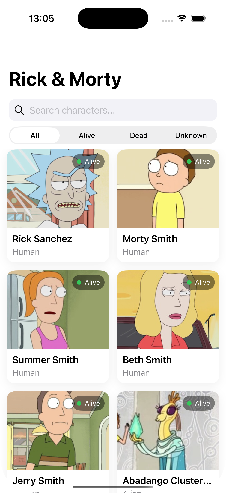
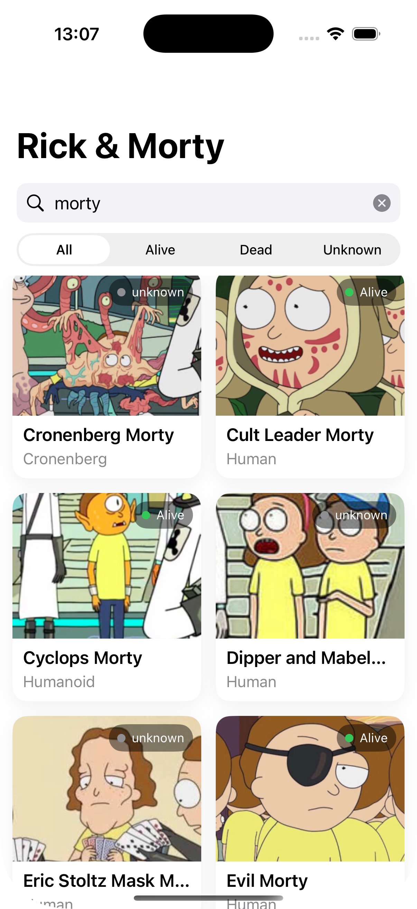
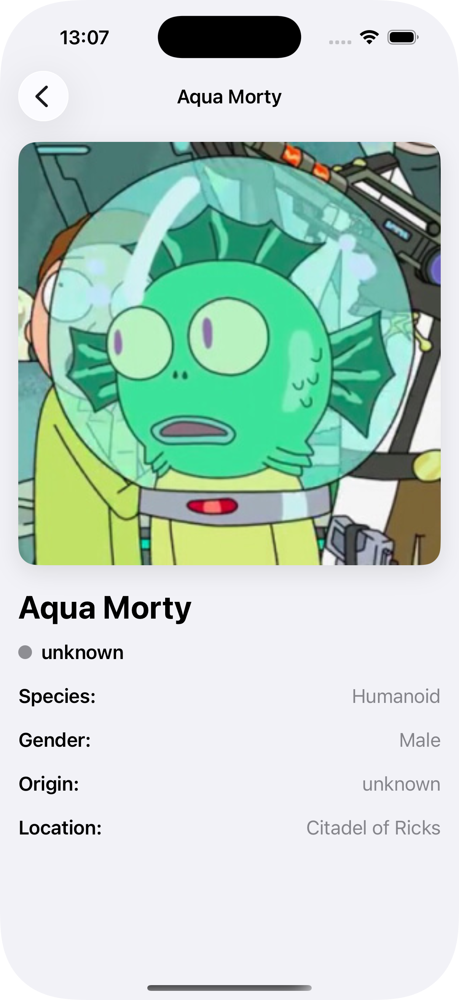

# Rick & Morty App 🛸

An iOS app built with SwiftUI that lets you explore all characters from the Rick and Morty universe. Browse, search, and filter characters using the public Rick and Morty API.

---

## Screenshots

| Character List | Search | Detail |
|:-:|:-:|:-:|
|  |  |  |

---

## Features

- 📋 Browse all Rick & Morty characters in a clean grid layout
- 🔍 Real-time search by character name
- 🎛️ Filter characters by status: **All**, **Alive**, **Dead**, **Unknown**
- 📄 Detail view with species, gender, origin, and location
- 🖼️ Image caching for smooth and fast scrolling
- ✅ Unit tests included

---

## Architecture

This project follows the **MVVM (Model-View-ViewModel)** pattern:

```
RickAndMorty/
├── Models/                        # Data models (Character, ApiResponse, etc.)
│   └── Character
├── Services/                      # Networking and data layer
│   ├── APIClient                  # HTTP request handling
│   ├── APIService                 # Endpoint definitions and API logic
│   └── ImageCacheService          # Image download and caching
├── ViewModels/                    # Business logic and state management
│   └── CharacterListViewModel     # State for character list + filtering
├── Views/                         # SwiftUI views and UI components
│   └── Shared/
│       ├── CachedAsyncImage       # Reusable image view with cache support
│       ├── CharacterCardView      # Grid card for each character
│       ├── CharacterDetailView    # Full detail screen
│       └── CharacterGridView      # Main grid layout view
└── RickAndMortyTests/             # Unit tests
    └── RickAndMortyTests
```

---

## Tech Stack

| Technology | Description |
|---|---|
| Swift | Primary language |
| SwiftUI | UI framework |
| MVVM | Architecture pattern |
| URLSession | Networking |
| Kingfisher | Image loading & caching |
| XCTest | Unit testing |

---

## API

This app consumes the public [Rick and Morty API](https://rickandmortyapi.com/).

| Endpoint | Description |
|---|---|
| `GET /character` | Paginated list of all characters |
| `GET /character?name=&status=` | Search and filter characters |
| `GET /character/{id}` | Single character detail |

No API key required.

---

## Requirements

- iOS 16.0+
- Xcode 15+
- Swift 5.9+
- Internet connection

---

## Installation

1. Clone the repository:
```bash
git clone https://github.com/jcreyesDev/rickandmorty.git
```

2. Open the project in Xcode:
```bash
cd rickandmorty
open RickAndMorty.xcodeproj
```

3. Resolve Swift Package Manager dependencies:
   - Xcode will automatically resolve SPM packages on first open
   - If not, go to **File → Packages → Resolve Package Versions**

4. Select a simulator or device and press **⌘R** to run.

---

## Running Tests

In Xcode, press **⌘U** to run the full test suite, or navigate to **Product → Test**.

---

## Author

Developed by [@jcreyesDev](https://github.com/jcreyesDev)
